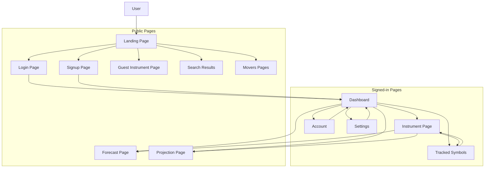

# Frontend Diagram

This diagram shows the current frontend flow at a high level.

## Notes

- Guests can browse the landing page, open auth pages, and search into instrument pages.
- The dashboard is the signed-in home page.
- The instrument page is the main chart page for a selected symbol.
- Forecast and projection routes are public pages in the router, but the current frontend API helpers still require a token before running the requests.
- The tracked-symbols page is the full watch board for saved names.
- Account and settings are available from the user menu.
- Local testing can use `http://127.0.0.1:8000` as a frontend/full-stack origin or the Vite dev server at `http://127.0.0.1:5173`.
