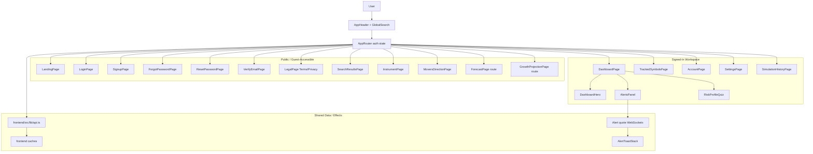

# Frontend Diagram

This diagram shows the current frontend routing and major data flows.

## Route Notes

- `/` is guest-only. Signed-in users are redirected to `/dashboard`.
- `/login` and `/signup` are guest-only.
- `/forgot-password`, `/reset-password/:token`, `/verify-email/:token`, `/terms`, and `/privacy` are public.
- `/dashboard`, `/tracked-symbols`, `/account`, `/settings`, and `/simulation-history` require a token.
- `/search-results/:query`, `/instrument/:symbol`, `/movers/gainers`, and `/movers/losers` are guest-accessible and become richer when a token is present.
- `/forecast/:symbol` and `/instrument/:symbol/project` are public routes, but the current frontend API helpers still require a token before calling the backend forecast/projection endpoints.

## Dashboard Layout

The signed-in dashboard currently renders:

- `DashboardHero` beside `FeaturedMoverCard`.
- `TrackedSymbolsPreview` beside the Random Forest insight card.
- `DailyMoversSection` with live market-data and forecasting-vs-projection insight cards between gainers and losers.
- MAE and Monte Carlo insight cards between movers and alerts.
- compact `AlertsPanel`.
- full-width responsible-use insight card.

## Important Components

- `AppHeader` owns the top navigation shell and swaps the center search input on search-results routes.
- `GlobalSearch` drives navigation into search results and instrument pages.
- `DashboardHero` displays the signed-in welcome copy and risk-profile prompt/badge.
- `DailyMoversSection` owns the gainers/losers layout and optional in-between content.
- `DailyMoverCard` renders the colored mover panels.
- `InsightCard` renders static product/education cards.
- `AlertsPanel` renders compact dashboard alert stats, notification state, bulk actions, and active/triggered/paused alert previews.
- `InstrumentChartCard`, `ForecastPage`, `GrowthProjectionPage`, and `TopResultCard` share the dark chart tooltip shell from `styles/components/ChartTooltip.css`.

## Frontend Data Flow

- `AppRouter` stores the auth token in localStorage under `marketmetrics.token`.
- `AppRouter` loads dashboard data with `fetchCurrentUser`, `fetchMovers`, `fetchWatchlist`, and `fetchAlerts`.
- Dashboard data is cached for 30 seconds per token.
- Active alert symbols open WebSocket connections through `buildWebSocketUrl` and `buildWebSocketProtocols`.
- WebSocket `alert_triggered` messages update the alert workspace, show in-app toasts, and optionally use browser notifications.
- `api.ts` dispatches `marketmetrics:session-expired` on any 401 so the app can log out globally.

## Local Testing

- Vite dev: `http://127.0.0.1:5173`
- FastAPI/full-stack local origin: `http://127.0.0.1:8000`
- Deployed test backend: `https://marketmetrics.onrender.com`

Use `VITE_API_BASE_URL` and `VITE_ALLOW_REMOTE_API_IN_DEV=true` when intentionally pointing local frontend development at the deployed backend.
