# Frontend Diagram

This diagram shows the current frontend routing structure and major data flows.

```mermaid
flowchart TD
    U["User"]
    H["AppHeader + GlobalSearch"]
    A["AppRouter (auth state, dashboard data)"]

    subgraph Public["Public / Guest-Accessible"]
        L["LandingPage /"]
        LI["LoginPage /login"]
        SU["SignupPage /signup"]
        FP["ForgotPasswordPage /forgot-password"]
        RP["ResetPasswordPage /reset-password/:token"]
        VE["VerifyEmailPage /verify-email/:token"]
        LG["LegalPage /terms, /privacy"]
        SR["SearchResultsPage /search-results/:query"]
        IP["InstrumentPage /instrument/:symbol"]
        MG["MoversDirectionPage /movers/gainers, /movers/losers"]
        FC["ForecastPage /forecast/:symbol"]
        GP["GrowthProjectionPage /instrument/:symbol/project"]
    end

    subgraph SignedIn["Signed-In Only"]
        D["DashboardPage /dashboard"]
        DH["DashboardHero"]
        TS["TrackedSymbolsPage /tracked-symbols"]
        AP["AlertsPanel"]
        AC["AccountPage /account"]
        ST["SettingsPage /settings"]
        SH["SimulationHistoryPage /history"]
    end

    subgraph Admin["Admin Only (isAdmin required)"]
        AU["AdminUsersPage /admin/users"]
        AL["AdminAuditLogsPage /admin/audit-logs"]
    end

    subgraph SharedData["Shared Data / Effects"]
        API["frontend/src/lib/api.ts"]
        WS["Alert quote WebSockets"]
        CACHE["Frontend caches"]
        TOAST["AlertToastStack"]
    end

    U --> H
    H --> A
    A --> L
    A --> LI
    A --> SU
    A --> FP
    A --> RP
    A --> VE
    A --> LG
    A --> SR
    A --> IP
    A --> MG
    A --> FC
    A --> GP
    A --> D
    D --> DH
    D --> AP
    A --> TS
    A --> AC
    A --> ST
    A --> SH
    A --> AU
    A --> AL
    A --> API
    API --> CACHE
    AP --> WS
    WS --> TOAST
```



---

## Route Notes

- `/` is guest-only. Signed-in users are redirected to `/dashboard`.
- `/login` and `/signup` are guest-only. Signed-in users are redirected to `/dashboard`.
- `/forgot-password`, `/reset-password/:token`, `/verify-email/:token`, `/terms`, and `/privacy` are public (no auth required or checked).
- `/dashboard`, `/tracked-symbols`, `/account`, `/settings`, and `/history` require a token. Users without a token are redirected to login.
- `/search-results/:query`, `/instrument/:symbol`, `/movers/gainers`, and `/movers/losers` are guest-accessible. Watchlist and alert features within those pages require a token.
- `/forecast/:symbol` and `/instrument/:symbol/project` are public routes in the router, but the current `fetchForecast` and `fetchGrowthProjection` API helpers still require a token before sending requests to the backend.
- `/admin/users` and `/admin/audit-logs` require a token and `isAdmin` access. Regular users will see a permission error or be redirected.

All authenticated pages use `React.lazy` + `<Suspense fallback={<RouteLoadingState />}>` for code splitting.

---

## Dashboard Layout

The signed-in dashboard currently renders in this order:

1. `DashboardHero` beside `FeaturedMoverCard` (two-column, collapses on mobile).
2. `TrackedSymbolsPreview` showing up to four tracked symbols in a compact grid, beside the Random Forest insight card.
3. `DailyMoversSection` with live gainers/losers data and forecast-vs-projection insight cards between the two mover panels.
4. MAE and Monte Carlo insight cards between daily movers and the alerts panel.
5. Compact `AlertsPanel` with notification state, stats, bulk actions, and active/triggered/paused alert previews.
6. Full-width responsible-use insight card at the bottom.

---

## Key Components

| Component | Purpose |
|---|---|
| `AppHeader` | Top navigation shell; swaps center slot to `SearchResultsHeaderInput` on `/search-results/*` routes |
| `GlobalSearch` | Dropdown search with "View all results" link to search results page |
| `DashboardHero` | Signed-in welcome copy and risk-profile prompt/badge |
| `FeaturedMoverCard` | Featured top gainer/loser with period, direction, and asset-type controls |
| `DailyMoversSection` | Gainers and losers layout with optional between-content slots |
| `DailyMoverCard` | Individual colored mover panel |
| `MoverSparklineCard` | Mover card with sparkline chart on the movers direction pages |
| `InsightCard` | Static product/education cards placed around dashboard content |
| `AlertsPanel` | Compact dashboard alert workspace |
| `AlertToastStack` | In-app triggered alert notifications |
| `SearchResultCard` | Card used in search results grid |
| `TrackedSymbolCard` | Card for tracked-symbol management page |
| `InstrumentChartCard` | Historical chart on instrument detail pages |
| `PricePredictionPanel` | Forecast output panel on the forecast page |
| `SimilarInstrumentsSection` | Similar instruments carousel on instrument pages |
| `MoverLogo` | Symbol logo resolver (CoinGecko for crypto, Google favicon for others) |

Chart tooltip styles for `InstrumentChartCard`, `ForecastPage`, `GrowthProjectionPage`, and `TopResultCard` share a common dark tooltip shell in `styles/components/ChartTooltip.css`.

---

## Frontend Data Flow

- `AppRouter` stores the auth token in `localStorage` under `marketmetrics.token`.
- On mount, `AppRouter` fetches current user, movers, watchlist, and alerts. Dashboard data is cached for 30 seconds per token.
- Active alert symbols drive WebSocket connections via `buildWebSocketUrl` and `buildWebSocketProtocols`.
- WebSocket `alert_triggered` messages update the alert state, show in-app toasts, and optionally trigger browser notifications.
- `api.ts` dispatches a `marketmetrics:session-expired` custom event on any 401 response so the app can log out globally without prop drilling.

---

## Admin Data Flow

- `AppRouter` checks the `isAdmin` flag on the current user object after login.
- Admin routes (`/admin/users`, `/admin/audit-logs`) are only accessible if `user.isAdmin` is true.
- `AdminUsersPage` and `AdminAuditLogsPage` are lazy-loaded and mounted at their respective routes.
- Admin navigation links appear in `UserMenu` only for admin users.

---

## Local Development

| Setup | URL |
|---|---|
| Vite dev server | `http://127.0.0.1:5173` |
| FastAPI + built frontend (local) | `http://127.0.0.1:8000` |
| Deployed test backend | `https://marketmetrics.onrender.com` |

To point local frontend development at the deployed backend, set in `frontend/.env.development`:

```text
VITE_API_BASE_URL=https://marketmetrics.onrender.com
VITE_ALLOW_REMOTE_API_IN_DEV=true
```

Add the local frontend origin to `ADDITIONAL_FRONTEND_ORIGINS` in the deployed backend's Render env vars to allow CORS and Google OAuth redirects from that origin.
